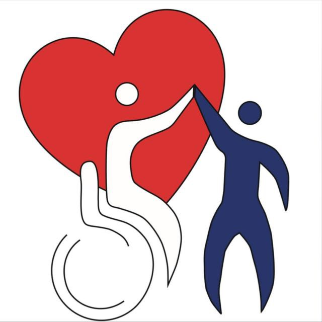

# D'un Pas à l'autre - WebSite
<p align="center">



------------------------------------------------------------------------

# Présentation

**D'un Pas à l'autre** est une association inclusive qui a pour mission
de **favoriser la rencontre, le partage et l'inclusion à travers des
événements sportifs et culturels accessibles à tous**.

Ce projet correspond au **site officiel de l'association**, permettant
de :

-   présenter l'association et ses valeurs
-   informer sur les événements organisés
-   promouvoir l'inclusion dans le sport et la culture
-   faciliter la communication avec le public

Le site a été développé avec Vue.js afin de proposer une interface
moderne, rapide et responsive.

------------------------------------------------------------------------

# Aperçu du site

🌐 Site en ligne :\
https://dunpasalautre.com

------------------------------------------------------------------------

# Technologies utilisées

-   Vue.js\
-   JavaScript\
-   HTML5\
-   CSS3\
-   Node.js\
-   npm

------------------------------------------------------------------------

# Installation du projet

Clone le repository :

``` bash
git clone https://github.com/SullivanMICHEL/DunPasALAutre.git
cd DunPasALAutre
```

Installer les dépendances :

``` bash
npm install
```

------------------------------------------------------------------------

# Lancer le projet en développement

``` bash
npm run dev
```

Cette commande démarre le serveur de développement et permet d'accéder
au site en local.

------------------------------------------------------------------------

# Compiler le projet pour la production

``` bash
npm run build
```

Cette commande génère une version optimisée du site dans le dossier :

    dist/

Ce dossier peut ensuite être déployé sur un serveur web.

------------------------------------------------------------------------

# Structure du projet

    src/
     ├── assets/        # Images, styles et ressources
     ├── components/    # Composants Vue réutilisables
     ├── views/         # Pages principales
     ├── router/        # Configuration des routes
     ├── App.vue        # Composant principal
     └── main.js        # Point d'entrée de l'application

------------------------------------------------------------------------

# Objectifs de l'association

L'association **D'un pas à l'autre** agit pour :

-   favoriser **l'inclusion dans le sport**
-   encourager **les rencontres entre les publics**
-   organiser des **événements sportifs et culturels accessibles**
-   promouvoir **le vivre ensemble**

------------------------------------------------------------------------

# Contribution

Les contributions sont les bienvenues.

1.  Fork le repository
2.  Créez une branche


<!-- -->

    git checkout -b feature/amelioration

3.  Commit vos modifications
4.  Ouvrez une Pull Request

------------------------------------------------------------------------

# Auteur

Projet développé par :

**Sullivan Michel**

GitHub :\
https://github.com/SullivanMICHEL

------------------------------------------------------------------------

# Licence

Projet réalisé pour l'association **D'un Pas à l'autre**.\
Utilisation libre dans un cadre associatif et non commercial.
